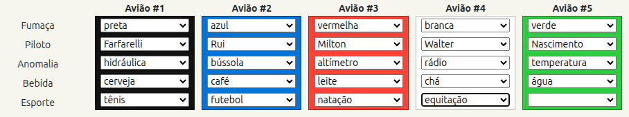
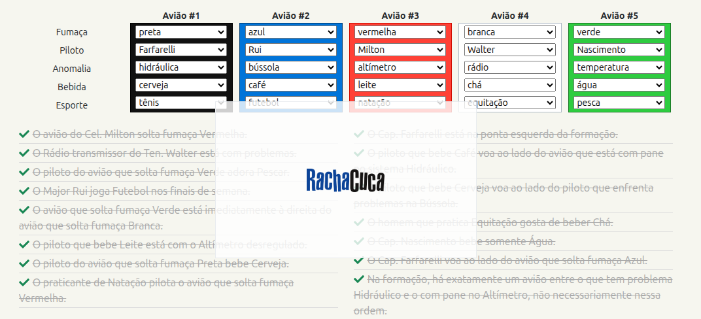

- # Esquadrilha

Este repositório contém uma solução em Prolog para o puzzle lógico "Esquadrilha" (estilo RachaCuca).

O que é
-------
Um programa que encontra a configuração correta de 5 aviões em formação, dada uma lista de pistas. Cada avião é um termo Prolog com 5 atributos: fumaça, piloto, anomalia, bebida e esporte.

Executar
-------
**Pré-requisito:** SWI-Prolog. Se não tiver instalado, rode:

```bash
sudo apt install swi-prolog-core
```

Depois, carregue o arquivo e chame o predicado principal:

```bash
swipl -s esquadrilha.pl -g "resolve_avioes(S), portray_clause(S), halt."
```

Imagens
------
As imagens abaixo mostram a solução (capturas do enunciado/solução). 





Observações sobre saída
-----------------------
O resultado `S` é um termo `esquadrilha/5`. Cada avião aparece na posição correspondente (1..5). Por exemplo, a saída pode se parecer com:

	esquadrilha(
		aviao(preta, farfarelli, hidraulico, cerveja, tenis),
		aviao(azul, rui, bussola, cafe, futebol),
		aviao(vermelha, milton, altimetro, leite, natacao),
		aviao(branca, walter, radio, cha, equitacao),
		aviao(verde, nascimento, temperatura, agua, pescar)
	)


Descrição técnica (predicados principais)
---------------------------------------
- `resolve_avioes(S)` — monta a estrutura `esquadrilha/5` e aplica todas as pistas como restrições lógicas.
- Acessores:
	- `fumaca(aviao(F,_,_,_,_), F)`
	- `piloto(aviao(_,P,_,_,_), P)`
	- `anomalia(aviao(_,_,A,_,_), A)`
	- `bebida(aviao(_,_,_,B,_), B)`
	- `esporte(aviao(_,_,_,_,E), E)`
- Predicados utilitários sobre posições e relações:
	- `algum_aviao/2`, `posicao/3`, `exatamente_a_direita/3`, `ao_lado/3`, `separado_por_um/3`, entre outros.